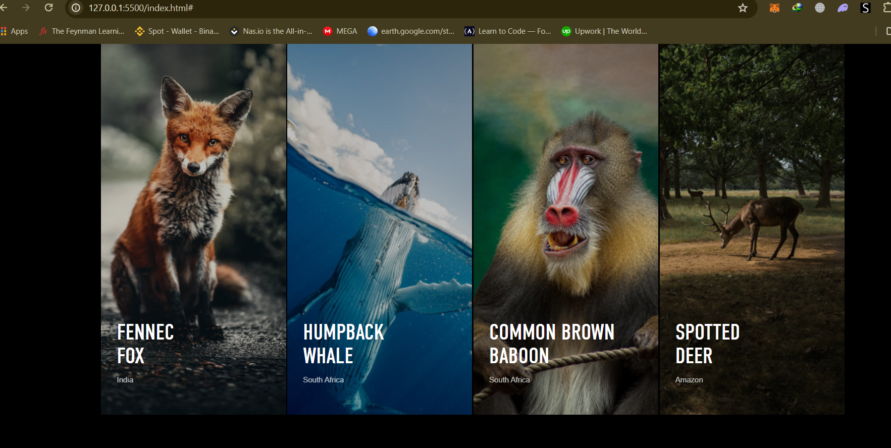
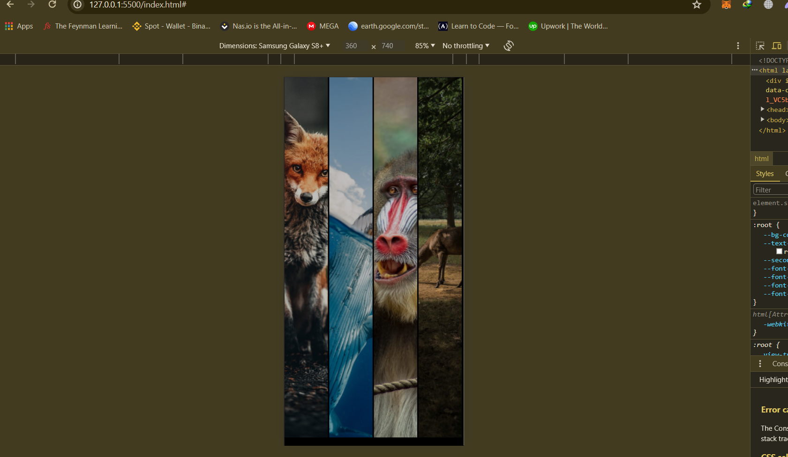

# COA-take-home-challge
Welcome to the COA Interactive Photo Gallery project! This project showcs an interactive photo gallery using HTML, CSS, and JavaScript. It is designed to be responsive and visually appealing, with hover effects and interactive elements.

## Overview

This project consists of two main challenges:

1. **Photo Gallery**
2. **Coding Challenge: Array and String Transformations**

## UI Challenge: Photo Gallery

### Description

The Photo Gallery challenge involves creating a web page that displays a gallery of images. The project uses HTML, CSS, and JavaScript to achieve this.

### Files and Folders

- `index.html`: The main HTML file that contains the structure of the web page.
- `style.css`: The CSS file that styles the web page.
- `script.js`: The JavaScript file that adds interactivity to the web page.
- `assets/`: A folder containing the images for the gallery.
### Features ###
- Responsive design for various screen sizes.
- Interactive hover effects on images.
- Captions with Headings and location.
- "Know More" link with a right arrow icon that appears on hover.
- Easy to extend and customize.
### Technologies Used ###
- HTML5
- CSS3
    * Flexbox
    * Transitions
    * Media Querie*s
- JavaScript
- Google Fonts (Poppins, sans-serif,)
- Online WebFonts (DIN Condensed, san-serif)

### Setup and Usage
Follow these steps to set up and run the project locally:
 or Click here: https://github.com/ to access the project

For Local installation
1. Clone the repository:

2. git clone https://github.com/aime-stack/COA-take-home-challenge.git

3. Navigate to the project directory:

4. cd coa-photo-gallery

5. Open the project in your code editor:

6. code .

7. Open the index.html file in your browser to view the photo gallery.

For best practices 
Use and test the interactive photo gallery:

* Open the index.html file in your favorite web browser.
* Hover over the images to see the interactive effects.
* Observe the responsive behavior by resizing the browser window or viewing it on different devices.

### Desktop View screenshot

### Mobile View
(Desktop.png)

## Coding Challenge
Description
The Coding Challenge involves implementing functions to manipulate arrays and strings. There are two files: arrayMap.js and stringTransform.js.

Files
- arrayMap.js: Contains functions of finding a contiguous subarray that sums up to the targeted sum.
- stringTransform.js: Contains functions for transforming a string based on its length..

Getting Started
To run these challenges locally, follow the steps below.

Step 1:
* Ensure you have Node.js installed.
* And terminal like bash etc.
Step 2:
- Clone the repository
- cd coa-take-home-challenge in your terminal
- cd Challenges in your terminal to dive into the challenge folder.
- Type node arrayMap.js in your terminal to run the first challenges and get the results.
- Type node stringTransform.js in your terminal to run the second challenges and get the results.

